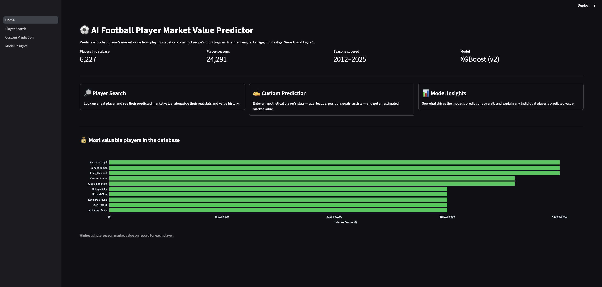
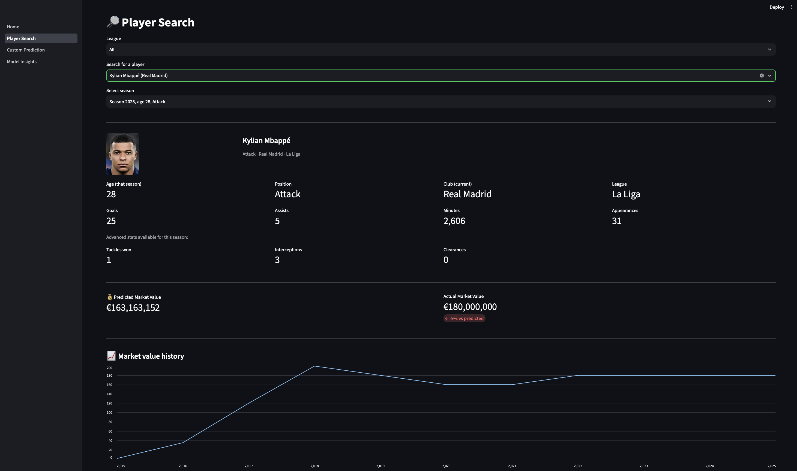
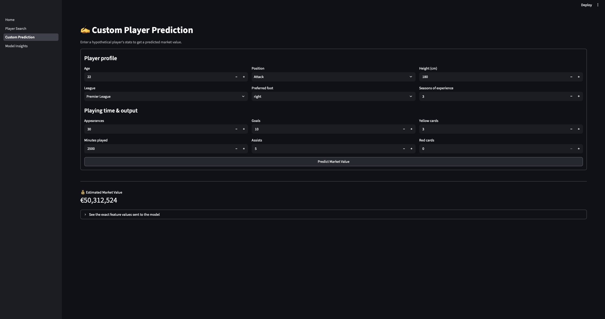
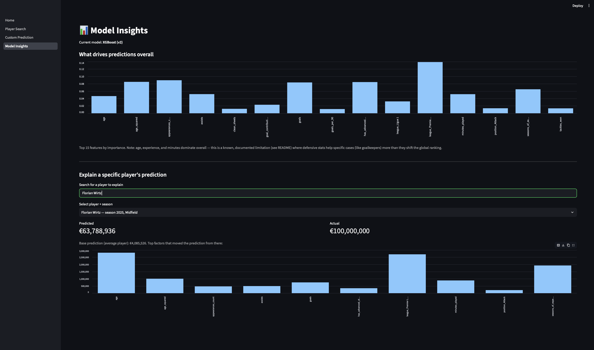
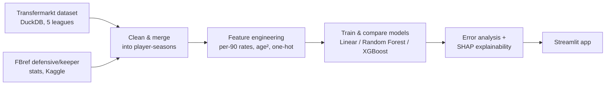

# ⚽ AI Football Player Market Value Predictor

Predicts a football player's market value (in €) from playing statistics,
using real historical data from Europe's top five leagues: Premier League,
La Liga, Bundesliga, Serie A, and Ligue 1.

A Streamlit app lets you:
- **🔎 Search a real player** — see their actual stats, club, and photo, alongside the model's predicted value and a value-history chart across their career.
- **✍️ Enter a custom/hypothetical player** — supply stats for an imagined player and get a predicted value, with input fields that adapt to the position chosen (defenders get defensive-stat fields, goalkeepers get keeper-stat fields).
- **📊 Explore model insights** — see what drives predictions overall, and get a live, per-player SHAP explanation of any individual prediction.







## What I learned

- **Data engineering is most of the work.** Cleaning, merging, and matching raw data across two different sources took far longer than training any model.
- **Evidence beats assumption.** A better algorithm alone didn't fix the position-fairness problem — SHAP proved it, which is what pushed me to go find real defensive/keeper data instead.
- **Debugging environment issues is a core ML skill.** Hit and fixed three separate library version mismatches (XGBoost on Mac, SHAP/XGBoost incompatibility, Kaggle API changes) — not just following a tutorial.
- **Know when to stop chasing a metric.** A smaller, "cleaner" training set looked better on one score but was worse where it actually mattered — reverted to the full dataset instead of picking the flattering number.
- **Explainability tools turn belief into proof.** SHAP's per-position breakdown is what revealed the position-fairness fix was only partial, not assumed accuracy.
- **Using the app surfaces bugs modeling alone never would.** Building Player Search exposed that club names and plain position labels never made it through the pipeline.


## Pipeline overview



## The data

**Primary source:** [transfermarkt-datasets](https://github.com/dcaribou/transfermarkt-datasets) — a weekly-updated DuckDB database with players, appearances, and market valuations already linked by `player_id`. Filtered to the five target leagues:

| Table | Rows |
|---|---|
| Players | 11,813 |
| Appearances (per game) | 726,823 |
| Market valuations | 191,754 |
| Clubs | 176 |

These were rolled up into one row per player per season (Aug–Jul convention), with market value attached as of each season's end. After dropping rows with missing position, no matched value, or under 90 minutes played: **24,291 player-season rows**, spanning seasons 2012–2025.

**Secondary source:** defensive and goalkeeper stats (tackles, interceptions, clearances, saves, clean sheets) aren't in Transfermarkt's data at all, so these were added from FBref data (via pre-scraped Kaggle datasets, matched by fuzzy name-matching within league+season). Match rate was 97-98% within the seasons FBref covers (2017–2023, 2025), 56.2% of the full dataset overall — seasons before 2017 and 2024 have no match and are zero-filled with a `has_advanced_stats` flag marking this.

## Features

- **Profile:** age, age², height, preferred foot, seasons of experience
- **Playing time:** appearances, minutes, minutes per appearance
- **Attacking output:** goals, assists, per-90 rates, goal contributions
- **Defensive/keeper output:** tackles, interceptions, clearances, blocks, saves, goals against, save %, clean sheets (+ per-90 versions)
- **Categorical:** league and position, one-hot encoded

Target: `market_value_eur`, log-transformed during training (the raw distribution is heavily right-skewed — median €350K vs. a max of €200M).

## Model comparison

Three algorithms were trained and compared on an identical 80/20 split, twice — once without defensive/keeper stats (v1), once with them (v2):

| Model | R² (log), v1 | R² (log), v2 | MAE (€), v1 | MAE (€), v2 |
|---|---|---|---|---|
| Linear Regression | 0.628 | 0.641 | 5.61M | 5.48M |
| Random Forest | 0.669 | 0.693 | 5.34M | 5.17M |
| **XGBoost** | **0.689** | **0.715** | **5.11M** | **4.83M** |

**XGBoost (v2) was selected as the final model.** A third experiment trained XGBoost on *only* the rows with real (non-zero-filled) defensive data — this slightly improved log-scale R² (0.725) but made euro-scale accuracy noticeably worse (MAE rose to €5.65M), because the smaller training set (13,655 vs 24,291 rows) hurt more than removing zero-fill noise helped. v2, using the full dataset, was kept as final.

## A specific design requirement: position-aware valuation

A key goal of this project was making sure players are valued on stats relevant to their position — a goalkeeper shouldn't be valued on goals the way a striker is. This was investigated directly, not assumed:

- **Linear Regression structurally can't do this** — it applies the same coefficient to every stat regardless of position.
- **Random Forest and XGBoost can learn position-stat interactions** — but doing so requires the data to actually contain position-relevant stats. Without defensive/keeper data (v1), SHAP analysis showed goals and minutes dominating valuations for every position, including goalkeepers — clearly wrong.
- **Adding real defensive/keeper stats (v2) gave a genuine, partial fix.** `clean_sheets` now shows up specifically in goalkeepers' top SHAP drivers — a clear, football-sensible win. But defenders and midfielders are still dominated by age/experience/minutes more than by tackles/interceptions, even after adding the data.
- **Conclusion:** defensive output is inherently less predictive of transfer market value than attacking output — a pattern that holds in the real transfer market too, not just an artifact of this dataset. This is documented as an honest finding, not hidden.

## Known limitations

- **Hype-driven young players are systematically underpredicted.** The 10 largest prediction errors are all young stars (Lamine Yamal, Jamal Musiala, Kylian Mbappé, etc.) whose market value reflects reputation and transfer speculation that no stats-only model can capture.
- **Error is highest at the value extremes** — under €500K (noisy, inconsistent valuations for fringe players) and over €20M (hype-driven) — and lowest in the €5–20M range.
- **Club shown in search results is the player's *current* club**, not necessarily their club in the specific season being viewed, since per-season club history wasn't tracked through the pipeline.
- **FBref coverage gaps:** seasons before 2017 and the 2024 season have no matched defensive/keeper data.

## Tech stack

Python · pandas · scikit-learn · XGBoost · SHAP · DuckDB · Streamlit · Plotly · rapidfuzz

## Project structure

football-market-value-predictor/
├── data/
│ ├── raw/ # source datasets (mostly gitignored; players.csv tracked for the app)
│ └── processed/ # cleaned, merged, feature-engineered data
├── notebooks/
├── src/
│ ├── data/ # download, clean, merge, consolidate scripts
│ ├── features/ # feature engineering
│ ├── models/ # training, comparison, error analysis
│ ├── explainability/ # SHAP analysis
│ └── app/ # Streamlit application
│ └── pages/
├── models/ # trained model + metadata (best_model.pkl tracked)
├── reports/figures/ # exported charts
├── requirements.txt
└── README.md


## Running it locally

```bash
python3 -m venv venv
source venv/bin/activate
pip3 install -r requirements.txt
streamlit run src/app/Home.py
```

The app loads the pre-trained model (`models/best_model.pkl`) and processed data (`data/processed/player_seasons_features_v2.csv`) directly — no retraining needed to use it. To reproduce the full pipeline from scratch, run the scripts in `src/data/`, `src/features/`, and `src/models/` in order (see commit history for the sequence).

## License

MIT — see LICENSE file.